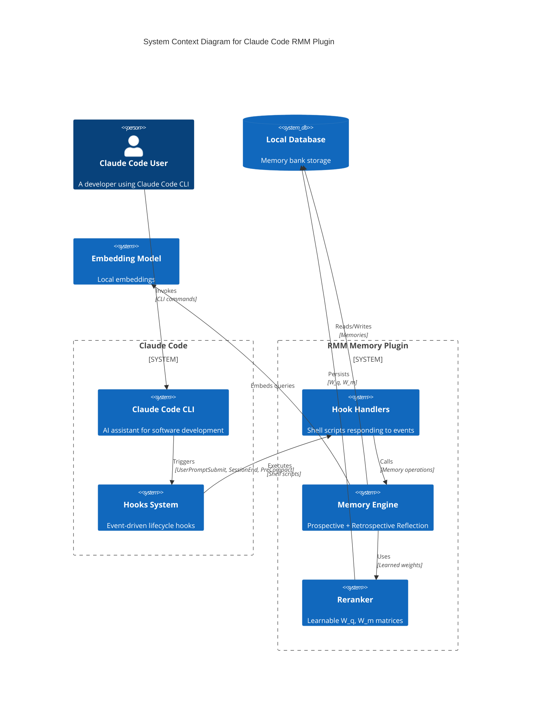
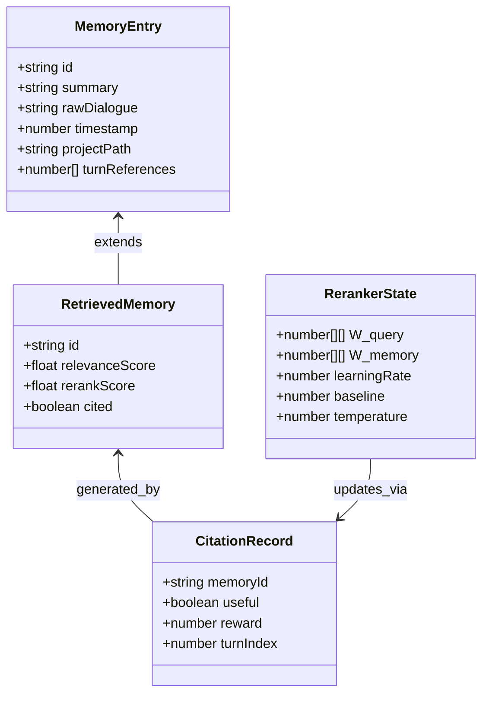

# PRD.md — Claude Code RMM Memory Plugin

## 1. Executive Summary

### Vision

A plug-and-play Claude Code plugin that provides **long-term conversational memory** for all Claude Code users, implementing the Reflective Memory Management (RMM) framework from academic research.

### Problem

Claude Code is stateless—by design, it forgets everything between sessions. Users lose:

- Project context discussed in previous conversations
- Preferences and patterns recognized during prior sessions
- Technical decisions and their rationale
- Personalization built up over time

This breaks the "personalized assistant" promise for users working on long-term projects.

### Jobs to be Done

| Job                            | User Pain                                                                                                 | Priority |
| ------------------------------ | --------------------------------------------------------------------------------------------------------- | -------- |
| **Remember project context**   | "I explained my codebase architecture last week—why do I have to repeat myself?"                          | P0       |
| **Recall technical decisions** | "What was the reasoning behind that API design we discussed?"                                             | P0       |
| **Maintain preferences**       | "I've told Claude multiple times I prefer TypeScript strict mode—why does it keep suggesting JavaScript?" | P1       |
| **Cross-session continuity**   | "I was working on this feature yesterday—where did I leave off?"                                          | P1       |
| **No memory loss during compaction** | "I had a long conversation but got compacted - will I lose those memories?" | P0       |

---

## 2. Ubiquitous Language

| Term                         | Definition                                                                           | Do Not Use                                   |
| ---------------------------- | ------------------------------------------------------------------------------------ | -------------------------------------------- |
| **Memory Bank**              | Persistent storage of extracted conversation facts, preferences, and decisions       | "knowledge base", "history", "context store" |
| **Session**                  | A single Claude Code conversation (from `SessionStart` to `SessionEnd`)              | "conversation", "thread"                     |
| **Memory Entry**             | A single atomic fact extracted from conversation                                     | "fact", "snippet", "memory fragment"         |
| **Prospective Reflection**   | Process of extracting memories from completed sessions using LLM prompts             | "memory extraction", "summarization"         |
| **Retrospective Reflection** | Process of retrieving relevant memories for current context, with adaptive reranking | "retrieval", "recall", "context injection"   |
| **Reranker**                 | Lightweight model (two matrices) that adapts memory retrieval to user patterns       | "retriever", "ranker"                        |
| **Citation**                 | Signal indicating whether a memory was useful in generating a response               | "attribution", "feedback"                    |
| **Turn Reference**          | Array of turn IDs from conversation that contributed to a memory                    | "turn IDs", "message references"            |
| **Project Context**          | The working directory / git repository being operated on                             | "workspace", "folder"                        |

---

## 3. Actors & Personas

### Primary Persona: The Solo Developer

- **Profile**: Works on personal projects, owns entire codebase
- **Pain**: Needs Claude to "just know" project conventions without re-explaining
- **Value**: Speed + continuity over configuration
- **Behavior**: Wants plug-and-play; minimal setup

### Secondary Persona: The Team Lead

- **Profile**: Manages team conventions, architectural decisions
- **Pain**: Enforcing patterns across team members and AI assistants
- **Value**: Consistency + auditability
- **Behavior**: May want configurable memory namespaces per project

### Tertiary Persona: The Power User

- **Profile**: Uses Claude Code extensively, has many projects
- **Pain**: Each new session feels like starting from zero
- **Value**: Customization + control
- **Behavior**: Willing to configure, wants fine-grained memory management

---

## 4. Functional Capabilities

### Epic 1: Memory Persistence (P0)

| Capability                     | Description                                             | Acceptance Criteria                                                             |
| ------------------------------ | ------------------------------------------------------- | ------------------------------------------------------------------------------- |
| **Session Boundary Detection** | Detect when a conversation session starts and ends      | Hooks trigger extraction at correct lifecycle points                            |
| **Memory Extraction (SessionEnd)** | After session ends, extract key facts using LLM prompts | Extracts memories as JSON with summary + turn references per paper Appendix D.1 |
| **Memory Extraction (PreCompact)** | Before context compaction, extract any new memories | Runs full re-extraction, deduplicates against existing turn references         |
| **Turn Reference Tracking**   | Track which conversation turns have been considered     | Each memory stores turn IDs; new extraction skips already-referenced turns     |
| **Memory Storage**             | Persist memories to local database                      | Memories survive Claude Code restart                                            |
| **Memory Loading**             | Before each user prompt, load relevant memories into context   | Memories are injected via UserPromptSubmit hook for fresh context on every prompt                              |

### Epic 2: Context Injection (P0)

| Capability                | Description                                            | Acceptance Criteria                             |
| ------------------------- | ------------------------------------------------------ | ----------------------------------------------- |
| **Pre-Compact Extraction** | Before context compaction, extract new memories       | Prevents memory loss during compaction          |
| **Pre-Compact Injection** | Before context compaction, inject memory context       | Memory survives long conversations              |
| **Semantic Retrieval**    | Retrieve memories semantically similar to current task | Uses embedding similarity search                |
| **Format Injection**      | Format memories per paper's Appendix D.2               | Memories appear as `<memories>` block in prompt |

### Epic 3: Adaptive Retrieval (P1)

| Capability              | Description                                    | Acceptance Criteria                         |
| ----------------------- | ---------------------------------------------- | ------------------------------------------- |
| **Learnable Reranking** | Implement paper's reranker (W_q, W_m matrices) | ~2.4MB weights stored per project (768×768) |
| **Citation Tracking**   | Parse LLM responses for [i,j,k] citations      | Tracks which memories were useful           |
| **Online Learning**     | Update reranker weights based on citations     | Weights improve over sessions               |

### Epic 4: Memory Management (P1)

| Capability            | Description                                  | Acceptance Criteria                        |
| --------------------- | -------------------------------------------- | ------------------------------------------ |
| **Memory Merge**      | Detect when new info updates existing memory | Uses paper's LLM prompt (Appendix D.1.2)   |
| **Memory Pruning**    | Remove obsolete or contradictory memories    | User can manually delete                   |
| **Project Isolation** | Separate memory banks per project directory  | Project A memories don't leak to Project B |

### Epic 5: User Experience (P2)

| Capability            | Description                                     | Acceptance Criteria            |
| --------------------- | ----------------------------------------------- | ------------------------------ |
| **Memory Inspection** | User can query "what do you remember about X?"  | Returns formatted memory list  |
| **Memory Commands**   | CLI commands for memory operations              | Available for memory ops       |
| **Opt-Out**           | User can disable memory per-session or globally | No memory stored when disabled |

---

## 5. Non-Functional Constraints

| Constraint        | Requirement                                                    |
| ----------------- | -------------------------------------------------------------- |
| **Latency**       | Session start overhead < 2 seconds (local database)            |
| **Storage**       | Local database; < 100MB for typical user (10k memories)        |
| **Privacy**       | All memory stored locally; no external services                |
| **Compatibility** | Works with Claude Code on macOS, Linux                         |
| **Dependencies**  | Minimal runtime, local embedding model, local database         |
| **Security**      | Memories scoped to project directory; no cross-project leakage |

---

## 6. Boundary Analysis

### In Scope

- Long-term memory across Claude Code sessions
- Semantic retrieval using embeddings
- Adaptive reranking (paper's REINFORCE approach)
- Per-project memory isolation
- Local-only storage (privacy-first)

### Out of Scope (MVP)

| Excluded Feature            | Reason                                 |
| --------------------------- | -------------------------------------- |
| **Multi-user sharing**      | Adds complexity; solo dev focus        |
| **Cloud sync**              | Privacy-first; local only for MVP      |
| **Memory encryption**       | Add later if needed; local is low-risk |
| **Team memory**             | Secondary to individual memory         |
| **Complex merge conflicts** | Simple overwrite for MVP               |
| **Memory visualization UI** | CLI commands only for MVP              |

---

## 7. Conceptual Diagrams

### C4 Context Diagram

### Domain Model

---

## Appendix: Operator Preferences

This section documents the user's explicit technical preferences, which inform implementation but do not appear in the core PRD.

### Implementation Decisions

| Decision              | Choice                    | Rationale                                   |
| --------------------- | ------------------------- | ------------------------------------------- |
| **Storage**           | SQLite                    | Simple, local, no external dependencies     |
| **Embeddings**        | Local model (Nomic/BGE)   | No API costs, better privacy                |
| **Scope**             | Per-project               | Auto-detect from working directory          |
| **Extraction LLM**    | Same LLM Claude Code uses | Leverages existing context                  |
| **Project Detection** | Auto-detect               | From git/working directory                  |
| **Opt-in**            | Enabled by default        | Out-of-box experience                       |
| **Complexity**        | Full RMM                  | Both Prospective + Retrospective Reflection |

### Code Reuse Strategy

The user has an existing LangChain RMM implementation at:
`/home/oscar/GitHub/langchain-middlewares-callbacks-ts/packages/rmm-middleware`

**Strategy**: Harvest code from the existing implementation rather than port directly. The algorithms (prospective reflection prompts, retrospective reflection reranker, REINFORCE updates) should be extracted into reusable modules that can be consumed by:

1. The existing LangChain middleware
2. The new Claude Code plugin

This avoids duplication while respecting the different execution contexts (LangChain agent state vs Claude Code hook system).

### Referenced Research

This PRD implements the RMM framework from:

- **Paper**: "In Prospect and Retrospect: Reflective Memory Management for Long-term Personalized Dialogue Agents" (Tan et al., ACL 2025)
- **arXiv**: 2503.08026v2
- **Key contributions**:
  - Prospective Reflection (topic-based memory organization)
  - Retrospective Reflection (RL-based retrieval refinement)
  - 10%+ accuracy improvement over baselines

---

_Document Version: 1.0_
_Created: 2026-02-20_
_Based on: arXiv:2503.08026v2 (ACL 2025)_
