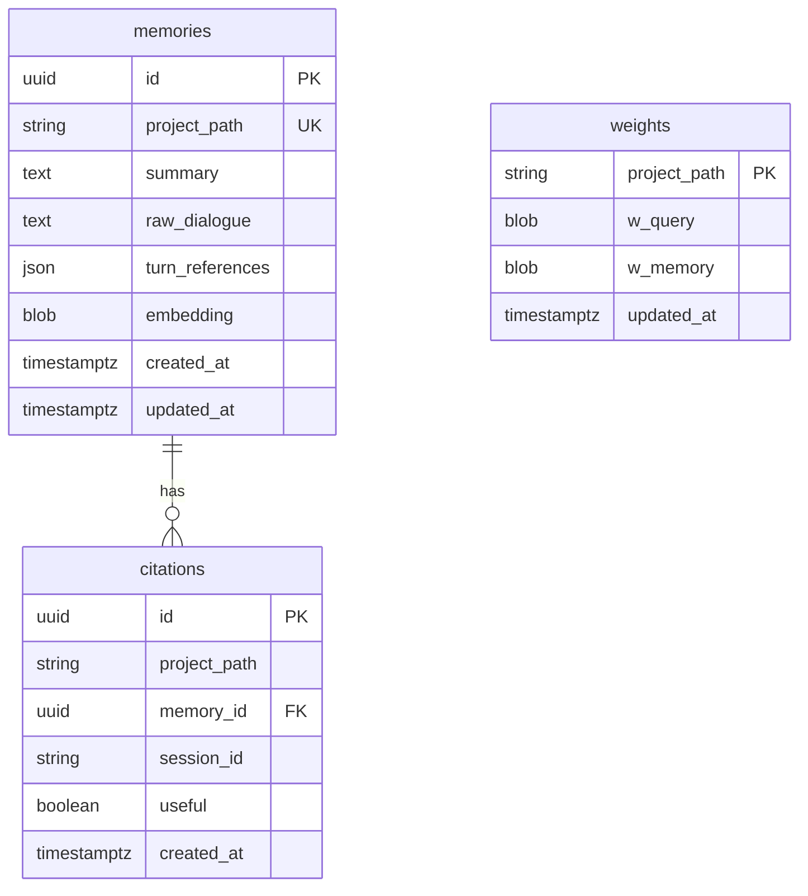

# TechSpec.md — Claude Code RMM Memory Plugin

## 1. Stack Specification (Bill of Materials)

| Component                | Choice                 | Version | Rationale                                              |
| ------------------------ | ---------------------- | ------- | ------------------------------------------------------ |
| **Runtime**              | Bun                    | 1.x     | Per project standards, native SQLite support           |
| **Language**             | TypeScript             | 5.x     | Per project standards, strict mode                     |
| **Database**             | SQLite                 | 3.x     | Via `bun:sqlite`, ACID compliance                      |
| **Embedding Model**      | `@xenova/transformers` | 2.x     | Local, private, no API costs                           |
| **Embedding Model Used** | `nomic-embed-text-v1`  | -       | 768 dimensions, best retrieval (86.2%)                 |
| **LLM Extraction**       | Claude CLI             | -       | `claude -p --output-format json` for memory extraction |
| **Linting**              | Biome                  | latest  | Per project standards                                  |
| **Build**                | Bun build              | -       | Executable scripts                                     |

### Dependencies

```json
{
	"dependencies": {
		"bun": ">=1.0.0",
		"typescript": "^5.0.0",
		"@xenova/transformers": "^2.17.0"
	},
	"devDependencies": {
		"biome": "^1.9.0",
		"@types/bun": "latest"
	}
}
```

---

## 2. Architecture Decision Records (ADRs)

### ADR-001: Embedding Model Selection

**Context:** Need local embedding model for semantic memory retrieval.

**Decision:** Use `@xenova/transformers` with `nomic-embed-text-v1`

**Consequences:**

- ✅ 768-dimension vectors (good balance of quality vs size)
- ✅ Best local retrieval score (86.2% on BEIR)
- ✅ Runs locally via ONNX runtime
- ✅ Works in Bun/Node.js
- ⚠️ First run downloads ~500MB model
- ⚠️ Requires 768×768 reranker matrices (~2.4MB)

### ADR-002: LLM Extraction via Claude CLI

**Context:** Need LLM for memory extraction from transcripts per RMM paper.

**Decision:** Use `claude -p --output-format json --json-schema` from hook scripts

**Consequences:**

- ✅ Uses Claude Code's own LLM
- ✅ Structured JSON output via schema
- ✅ No additional API keys needed
- ⚠️ Depends on Claude Code being installed
- ⚠️ Extraction takes longer than direct API call

### ADR-003: Code Reuse Strategy

**Context:** Existing rmm-middleware uses 1536-dim, we use 768-dim.

**Decision:** Copy and adapt algorithm code from existing implementation

**Consequences:**

- ✅ Clean adaptation to 768-dim
- ✅ No dependency on LangChain types
- ⚠️ Two codebases to maintain long-term

---

## 3. Database Schema (Physical ERD)



### Physical Table Definitions

```sql
-- Memories: Core memory storage (768-dim embeddings)
CREATE TABLE memories (
  id TEXT PRIMARY KEY,
  project_path TEXT NOT NULL,
  summary TEXT NOT NULL,
  raw_dialogue TEXT NOT NULL,
  turn_references TEXT, -- JSON array
  embedding BLOB, -- 768 floats (3072 bytes)
  created_at INTEGER NOT NULL, -- Unix timestamp
  updated_at INTEGER NOT NULL
);

-- Index for project-scoped queries
CREATE INDEX idx_memories_project ON memories(project_path);

-- Weights: Reranker state per project (768×768 matrices = 2.4MB)
CREATE TABLE weights (
  project_path TEXT PRIMARY KEY,
  w_query BLOB NOT NULL, -- 768×768 float32
  w_memory BLOB NOT NULL, -- 768×768 float32
  updated_at INTEGER NOT NULL
);

-- Citations: Learning signal storage
CREATE TABLE citations (
  id TEXT PRIMARY KEY,
  project_path TEXT NOT NULL,
  memory_id TEXT NOT NULL,
  session_id TEXT NOT NULL,
  useful INTEGER NOT NULL, -- 1 = useful, 0 = not useful
  created_at INTEGER NOT NULL,
  FOREIGN KEY (memory_id) REFERENCES memories(id)
);

-- Indices for citation aggregation
CREATE INDEX idx_citations_project ON citations(project_path);
CREATE INDEX idx_citations_session ON citations(session_id);
```

---

## 4. Hook Contract (CLI Interface)

### SessionStart Hook

**Input (stdin):**

```json
{
	"session_id": "abc123",
	"cwd": "/home/user/my-project",
	"hook_event_name": "SessionStart",
	"last_assistant_message": "",
	"prompt": ""
}
```

**Output (stdout):**

```json
{
	"hookSpecificOutput": {
		"hookEventName": "SessionStart",
		"additionalContext": "<memories>\n- Memory [0]: User prefers TypeScript strict mode\n  Original: \"I always use TypeScript with strict: true\"\n</memories>"
	}
}
```

### Stop Hook (Memory Extraction)

**Input (stdin):**

```json
{
	"session_id": "abc123",
	"cwd": "/home/user/my-project",
	"hook_event_name": "Stop",
	"transcript_path": "/home/user/.claude/projects/abc123.jsonl",
	"last_assistant_message": "I've completed the refactoring"
}
```

**Action:** Read transcript, call Claude CLI for extraction:

```bash
cat "$transcript_path" | claude -p \
  "$(cat <<'PROMPT'
Extract memories from this conversation transcript following the RMM framework.

Return JSON with this schema:
{
  "memories": [
    {
      "summary": "concise personal summary",
      "reference": [turn_id_1, turn_id_2]
    }
  ]
}

If no meaningful memories, return: {"memories": []}
PROMPT
)" \
  --output-format json \
  --json-schema '{
    "type": "object",
    "properties": {
      "memories": {
        "type": "array",
        "items": {
          "type": "object",
          "properties": {
            "summary": {"type": "string"},
            "reference": {"type": "array", "items": {"type": "number"}}
          },
          "required": ["summary", "reference"]
        }
      }
    },
    "required": ["memories"]
  }'
```

### PreCompact Hook

**Input (stdin):**

```json
{
	"session_id": "abc123",
	"cwd": "/home/user/my-project",
	"hook_event_name": "PreCompact",
	"last_assistant_message": "..."
}
```

**Output:** Same format as SessionStart, re-injects memories after compaction.

---

## 5. Implementation Guidelines

### Project Structure (Clean Architecture)

```
cc-rmm/
├── .claude-plugin/
│   └── plugin.json										# Plugin manifest
├── hooks/
│   ├── hooks.json										# Hook configurations
│   ├── session-start.ts							# Memory loading
│   ├── stop.ts												# Memory extraction
│   └── pre-compact.ts								# Memory re-injection
├── src/
│   ├── core/													# HARVESTED (adapted from rmm-middleware)
│   │   ├── algorithms/
│   │   │   ├── memory-extraction.ts	# Adapted for 768-dim
│   │   │   ├── memory-update.ts			# Merge/Add decisions
│   │   │   ├── reranking.ts					# W_q, W_m matrices
│   │   │   └── gumbel-sampling.ts		# Equation 2
│   │   ├── prompts/
│   │   │   ├── extract-speaker.ts		# Paper Appendix D.1
│   │   │   └── update-memory.ts			# Paper Appendix D.1.2
│   │   └── types/
│   │       └── memory.ts							# Domain types (768-dim)
│   ├── adapters/
│   │   └── claude-cli.ts							# Claude CLI wrapper
│   ├── storage/
│   │   ├── sqlite.ts									# Database operations
│   │   └── migrations.ts							# Schema migrations
│   ├── embeddings/
│   │   └── nomic.ts									# nomic-embed-text-v1 service
│   └── cli.ts												# Entry point router
├── scripts/
│   ├── install-model.ts							# Embedding model download
│   └── init-db.ts										# Database initialization
├── tests/
│   └── unit/
├── package.json
├── tsconfig.json
└── biome.jsonc
```

### Key Algorithm Adaptations (from rmm-middleware)

| Source File                       | Changes Needed                                          |
| --------------------------------- | ------------------------------------------------------- |
| `algorithms/reranking.ts`         | Change dimension from 1536 to 768                       |
| `algorithms/memory-extraction.ts` | Remove LangChain types, adapt for transcript file input |
| `algorithms/memory-update.ts`     | Remove LangChain dependencies                           |
| `utils/matrix.ts`                 | Already dimension-agnostic, no changes                  |
| `schemas/index.ts`                | Create 768-dim versions of schemas                      |

### Module Boundaries

```
┌──────────────────────────────────────────────────────────────┐
│                    Hook Scripts (CLI)                        │
│              (session-start, stop, pre-compact)              │
└──────────────────────────────────────────────────────────────┘
                              │
                              ▼
┌──────────────────────────────────────────────────────────────┐
│                    Claude CLI Adapter                        │
│            (claude -p --output-format json)                  │
└──────────────────────────────────────────────────────────────┘
                              │
                              ▼
┌──────────────────────────────────────────────────────────────┐
│                      Core Layer                              │
│  ┌──────────────┐  ┌─────────────┐  ┌─────────────┐          │
│  │ Prospective  │  │Retrospective│  │  Reranker   │          │
│  │  Reflection  │  │  Reflection │  │ (768×768)   │          │
│  └──────────────┘  └─────────────┘  └─────────────┘          │
└──────────────────────────────────────────────────────────────┘
                              │
                              ▼
┌──────────────────────────────────────────────────────────────┐
│                   Infrastructure Layer                       │
│     ┌─────────────┐  ┌─────────────┐  ┌─────────────┐        │
│     │   SQLite    │  │   Nomic     │  │    LLM      │        │
│     │   Storage   │  │  Embeddings │  │   (CLI)     │        │
│     └─────────────┘  └─────────────┘  └─────────────┘        │
└──────────────────────────────────────────────────────────────┘
```

---

## 6. Core Interfaces

```typescript
// Memory Entry (768-dim)
interface MemoryEntry {
	id: string;
	topicSummary: string;
	rawDialogue: string;
	timestamp: number;
	sessionId: string;
	embedding: number[]; // 768 dimensions
	turnReferences: number[];
}

// Reranker State (768×768)
interface RerankerState {
	weights: {
		queryTransform: number[][]; // 768×768
		memoryTransform: number[][]; // 768×768
	};
	config: {
		topK: number;
		topM: number;
		temperature: number;
		learningRate: number;
		baseline: number;
	};
}

// Embedding Service
interface IEmbeddingService {
	embedQuery(text: string): Promise<number[]>;
	embedDocument(text: string): Promise<number[]>;
}

// Claude CLI Extractor
interface IClaudeExtractor {
	extractMemories(transcriptPath: string): Promise<ExtractedMemory[]>;
}

// Storage Interface
interface IStorage {
	getMemories(projectPath: string): Promise<MemoryEntry[]>;
	searchSimilar(
		projectPath: string,
		embedding: number[],
		topK: number,
	): Promise<MemoryEntry[]>;
	saveMemory(memory: MemoryEntry): Promise<void>;
	mergeMemory(id: string, summary: string): Promise<void>;
	getWeights(projectPath: string): Promise<RerankerState | null>;
	saveWeights(projectPath: string, weights: RerankerState): Promise<void>;
	saveCitation(citation: CitationRecord): Promise<void>;
}
```

---

## 7. Implementation Phases

### Phase 1: Foundation (Week 1)

- [ ] Initialize project structure
- [ ] Set up SQLite schema and migrations
- [ ] Configure hooks.json
- [ ] Test hook integration with Claude Code
- [ ] Implement project path detection

### Phase 2: Storage & Embeddings (Week 1-2)

- [ ] Implement SQLite storage layer
- [ ] Add @xenova/transformers integration
- [ ] Test nomic-embed-text-v1 embedding generation
- [ ] Implement similarity search

### Phase 3: Harvest Core Algorithms (Week 2-3)

- [ ] Copy memory-extraction.ts, adapt for 768-dim
- [ ] Copy memory-update.ts, remove LangChain deps
- [ ] Copy reranking.ts, update matrix dimensions
- [ ] Copy matrix.ts (should work as-is)
- [ ] Copy and adapt prompts

### Phase 4: Claude CLI Integration (Week 3)

- [ ] Implement Claude CLI wrapper
- [ ] Test memory extraction via `claude -p`
- [ ] Connect hooks to extraction pipeline

### Phase 5: Retrieval & Learning (Week 3-4)

- [ ] Implement retrieval with embeddings
- [ ] Add reranking with W_q, W_m matrices
- [ ] Implement citation extraction from responses
- [ ] Add REINFORCE weight updates

### Phase 6: Polish (Week 4)

- [ ] Error handling and logging
- [ ] CLI commands (/memory list, etc.)
- [ ] Documentation

---

## 8. Key Design Decisions

| Decision                      | Rationale                                                  |
| ----------------------------- | ---------------------------------------------------------- |
| **768-dim embeddings**        | Best retrieval (86.2%), manageable reranker size (~2.4MB)  |
| **nomic-embed-text-v1**       | Highest quality local embedding model                      |
| **SQLite**                    | ACID compliance, Bun native support, per-project isolation |
| **Claude CLI for extraction** | No API keys needed, uses existing Claude Code              |
| **Copy-and-adapt code**       | Clean separation, dimension-specific optimizations         |
| **Per-project isolation**     | Git directory as natural boundary                          |

---

_TechSpec Version: 1.0_
_Based on: PRD.md v1.0, Architecture.md v1.0_
_Embedding Decision: nomic-embed-text-v1 (768-dim)_
