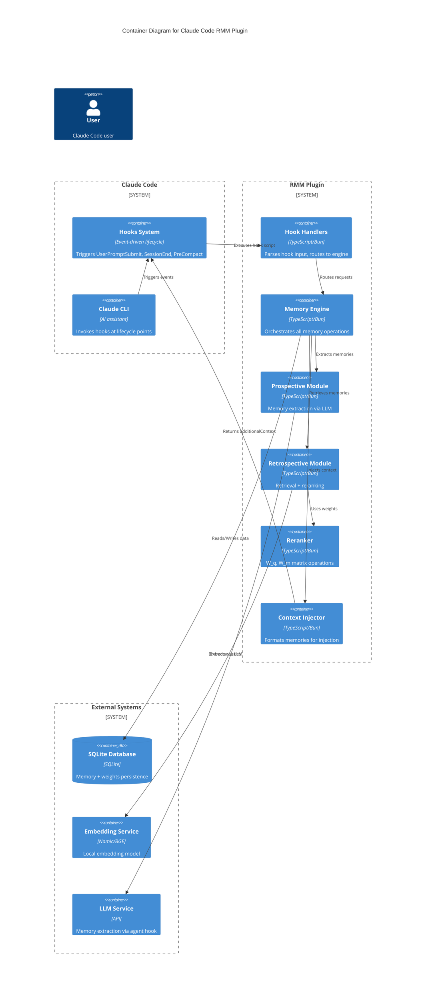
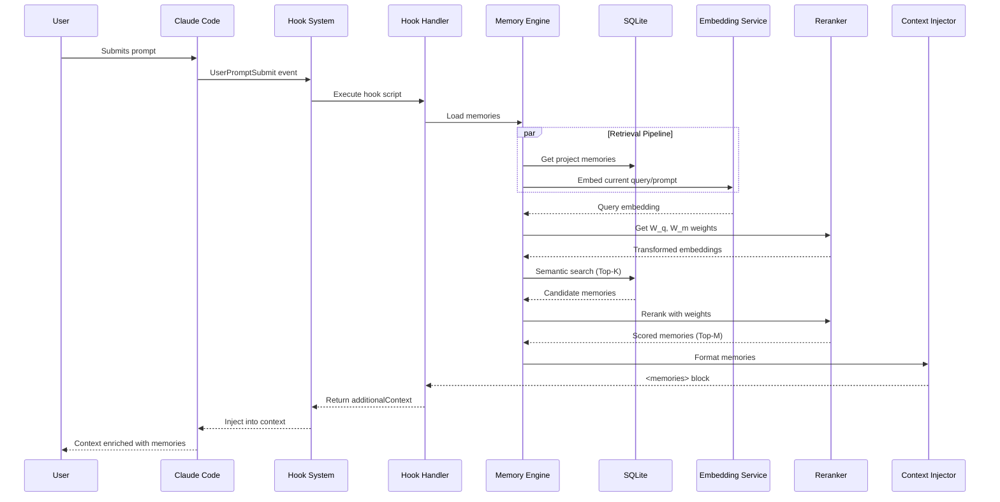
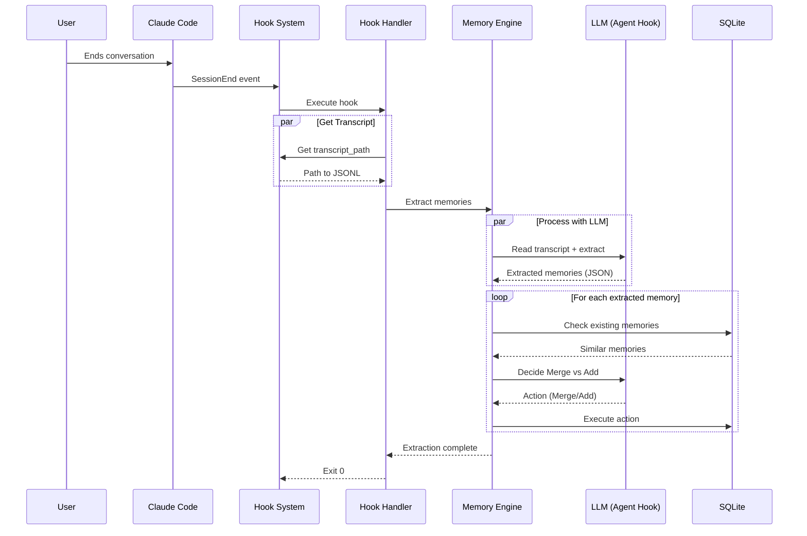
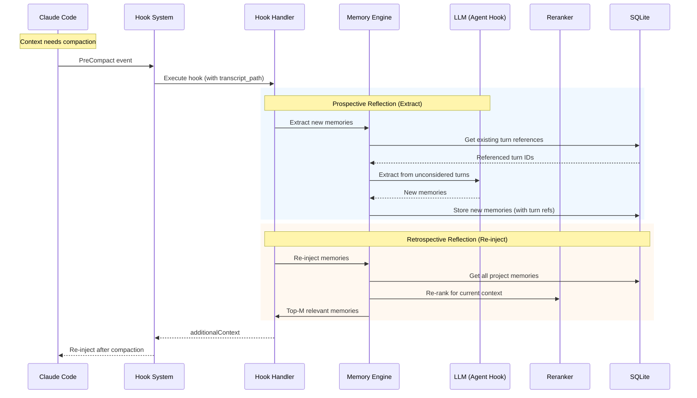

# Architecture.md — Claude Code RMM Memory Plugin

## 1. Architectural Strategy

### The Pattern: Event-Driven Modular Monolith

Per **Martin Fowler's** architectural guidance, this plugin uses an **Event-Driven Architecture** within a single deployable unit (the Claude Code plugin). This fits because:

1. **Natural Event Flow**: Claude Code hooks provide lifecycle events (`UserPromptSubmit`, `SessionEnd`, `PreCompact`) that naturally map to memory operations
2. **Solo Dev Constraints**: Single plugin directory, no distributed systems, minimal operational burden
3. **Separation of Concerns**: Distinct modules for extraction, retrieval, storage, and reranking

### Architectural Style Justification

| Alternative       | Rejected Because                                       |
| ----------------- | ------------------------------------------------------ |
| Pure MCP Server   | No lifecycle event triggers; must be explicitly called |
| Microservices     | Overhead unjustified for solo dev use case             |
| External Database | Violates privacy-first, local-only constraint          |

---

## 2. System Containers (C4 Level 2)

| Container                | Type            | Responsibility                                                           |
| ------------------------ | --------------- | ------------------------------------------------------------------------ |
| **Hook Handlers**        | Event Listeners | Respond to Claude Code lifecycle events (UserPromptSubmit, SessionEnd, PreCompact) |
| **Memory Engine**        | Core Service    | Orchestrates extraction, retrieval, merge operations                     |
| **Prospective Module**   | Processor       | Extracts memories from conversation transcript using LLM                 |
| **Retrospective Module** | Processor       | Retrieves and reranks memories for context injection                     |
| **Reranker**             | ML Model        | Lightweight W_q, W_m matrices for adaptive retrieval                     |
| **SQLite Storage**       | Database        | Persists memories and reranker weights                                   |
| **Embedding Service**    | External        | Local embedding model (Nomic/BGE) for similarity search                  |
| **Context Injector**     | Output          | Formats and injects memories into Claude Code context                    |

---

## 3. Container Diagram



---

## 4. Critical Execution Flows

### Flow 1: User Prompt Submit (Memory Loading)



**Note:** This flow runs on every user prompt, ensuring memories are always fresh.

### Flow 2: SessionEnd (Memory Extraction)



### Flow 3: Pre-Compact (Extract + Re-inject)



**Key difference from Flow 2 (SessionEnd):** PreCompact performs full re-extraction, letting deduplication (turn reference tracking) handle overlaps with memories already extracted at SessionEnd.

---

## 5. Resilience & Cross-Cutting Concerns

### Failure Mode Analysis

| Component             | Failure Scenario      | Mitigation                          |
| --------------------- | --------------------- | ----------------------------------- |
| **Hook Handler**      | Script exits non-zero | Log error, allow Claude to continue |
| **Memory Extraction** | LLM call fails        | Queue for retry, skip extraction    |
| **Embedding Service** | Model unavailable     | Fallback to keyword search          |
| **SQLite**            | Database locked       | Retry with exponential backoff      |
| **Reranker**          | Weights corrupted     | Re-initialize with random values    |

### Stability Patterns

| Pattern             | Location           | Implementation                                |
| ------------------- | ------------------ | --------------------------------------------- |
| **Circuit Breaker** | LLM calls          | After 3 failures, skip extraction for session |
| **Timeout**         | External calls     | 30s max for any LLM operation                 |
| **Bulkhead**        | Database           | Connection pool limit = 5                     |
| **Retry**           | Transient failures | 3 retries with 1s backoff                     |

### Observability

| Requirement        | Implementation                                   |
| ------------------ | ------------------------------------------------ |
| **Logging**        | Structured JSON to stderr (Claude Code captures) |
| **Correlation**    | session_id propagated through all operations     |
| **Error Tracking** | Hook exit codes: 0=success, 1=error, 2=block     |

---

## 6. Logical Risks & Technical Debt

### Identified Risks

| Risk                         | Likelihood | Impact | Mitigation                                               |
| ---------------------------- | ---------- | ------ | -------------------------------------------------------- |
| **Embedding model setup**    | High       | Medium | Document required installation, provide installer script |
| **LLM API rate limits**      | Medium     | High   | Implement request throttling                             |
| **Large transcript parsing** | Medium     | Low    | Stream parse, don't load full file                       |
| **Memory bank growth**       | Low        | Medium | Implement pruning after N sessions                       |

### Technical Debt (Deferred)

| Item                | Reason for Deferral    |
| ------------------- | ---------------------- |
| Team memory sharing | Out of scope for MVP   |
| Memory encryption   | Local-only, low risk   |
| Visual UI           | CLI sufficient for MVP |

---

## 7. Data Flow Summary

```
┌──────────────────────────────────────────────────────────┐
│                    Claude Code Lifecycle                 │
├──────────────────────────────────────────────────────────┤
│                                                          │
│  UserPromptSubmit ──► Load Memories ──► Inject Context   │
│       │                                                  │
│       ▼                                                  │
│  [User works with Claude]                                │
│       │                                                  │
│       ▼                                                  │
│  PreCompact ──► Extract (new) ──► Deduplicate ──► Re-inject │
│       │                                                  │
│       ▼                                                  │
│  [More user work]                                        │
│       │                                                  │
│       ▼                                                  │
│  SessionEnd ──► Extract Memories ──► Deduplicate ──► Persist   │
│                                                          │
└──────────────────────────────────────────────────────────┘
```

**Note:** Both PreCompact and SessionEnd trigger Prospective Reflection. Turn reference tracking ensures PreCompact only extracts unconsidered turns, preventing duplicates.

---

## 8. Key Design Decisions

| Decision                  | Rationale                                                    |
| ------------------------- | ------------------------------------------------------------ |
| **SQLite over file**      | ACID compliance, better query performance, built into Bun    |
| **Local embeddings**      | Privacy, no API costs, works offline                         |
| **Agent hooks for LLM**   | Built-in tool access, no external dependencies               |
| **W_q, W_m matrices**     | Paper's approach, ~2.4MB per project (768×768), CPU-friendly |
| **Per-project isolation** | Git directory as natural boundary                            |

---

## 9. Integration Points

### Claude Code Integration

| Event          | Hook Type | Action                   |
| -------------- | --------- | ------------------------ |
| `UserPromptSubmit` | command   | Load + inject memories before each prompt   |
| `SessionEnd`         | agent     | Extract memories via LLM |
| `PreCompact`   | agent     | Extract + re-inject memories |

> **Note**: Physical schema defined in TechSpec.md

---

_Architecture Version: 1.0_
_Based on: PRD.md v1.0, Claude Code Hooks Research_
