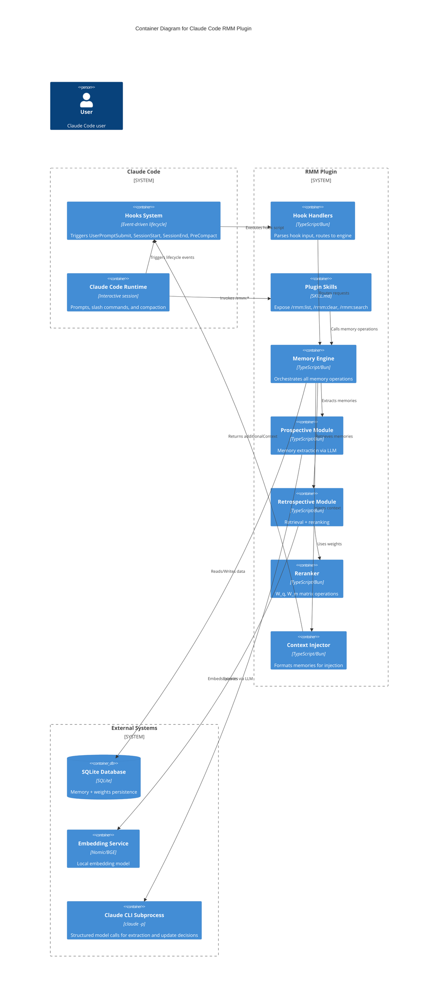
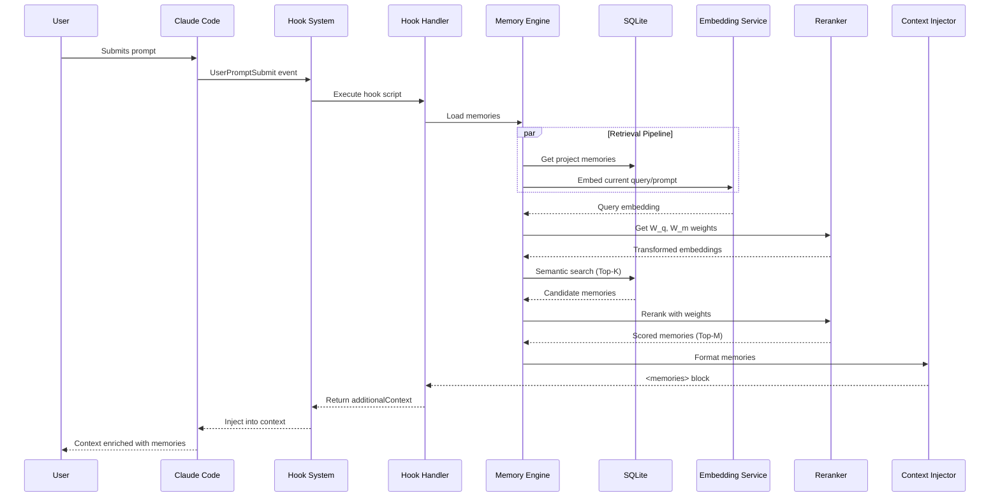
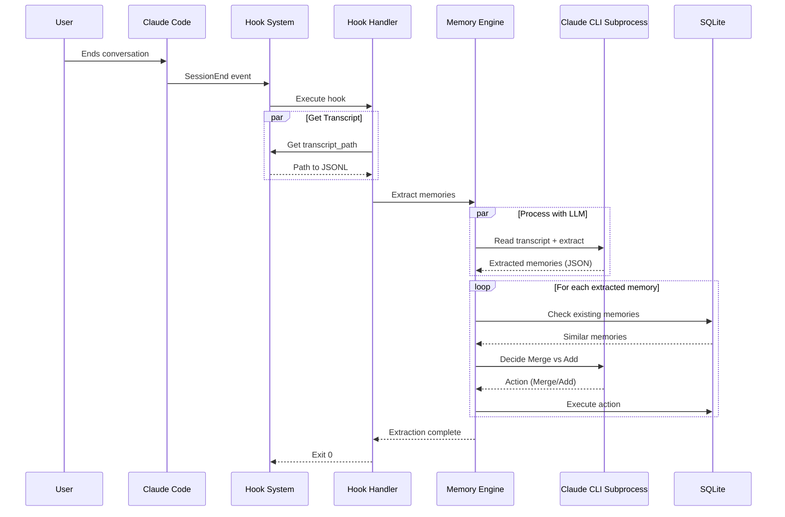
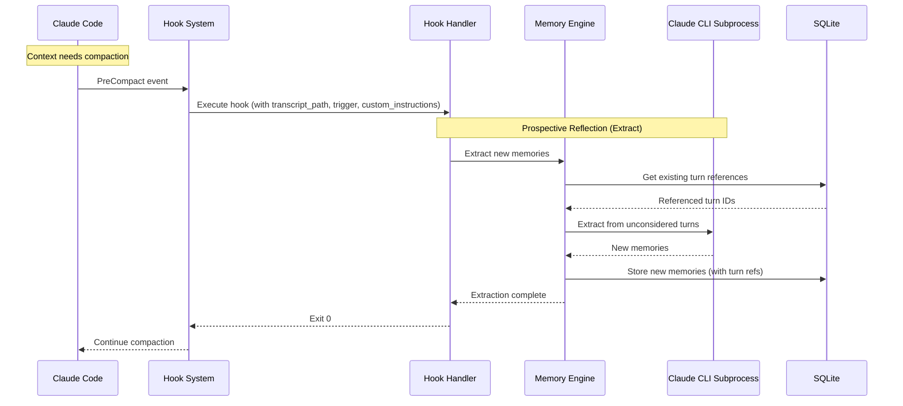
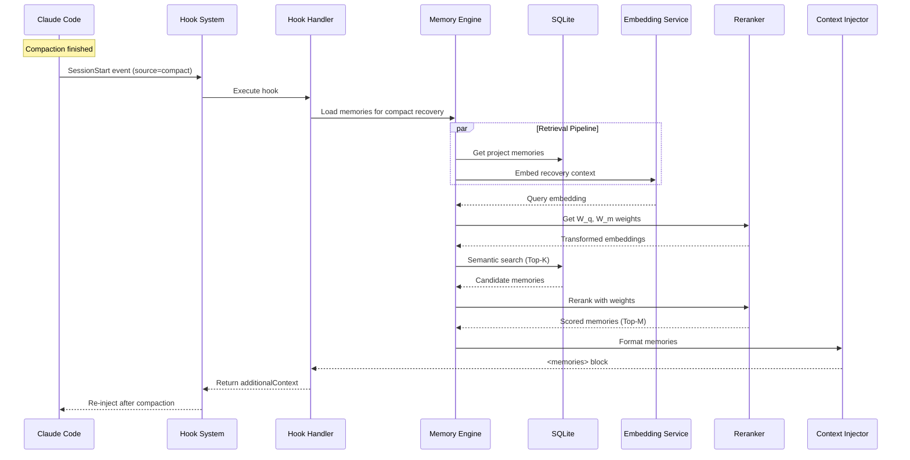

# Architecture.md — Claude Code RMM Memory Plugin

## 1. Architectural Strategy

### The Pattern: Event-Driven Modular Monolith

Per **Martin Fowler's** architectural guidance, this plugin uses an **Event-Driven Architecture** within a single deployable unit (the Claude Code plugin). This fits because:

1. **Natural Event Flow**: Claude Code hooks provide lifecycle events (`UserPromptSubmit`, `SessionStart`, `SessionEnd`, `PreCompact`) that naturally map to memory operations
2. **Solo Dev Constraints**: Single plugin directory, no distributed systems, minimal operational burden
3. **Separation of Concerns**: Distinct modules for extraction, retrieval, storage, and reranking

Claude Code's documented hook contract matters here: `UserPromptSubmit` and `SessionStart` are the context-injection surfaces, while `PreCompact` and `SessionEnd` are command-only side-effect hooks. Post-compaction reinjection therefore happens through `SessionStart` with matcher/source `compact`, not through `PreCompact` stdout. See [Hooks reference](https://code.claude.com/docs/en/hooks.md) and [Hooks guide](https://code.claude.com/docs/en/hooks-guide.md).

### Architectural Style Justification

| Alternative       | Rejected Because                                       |
| ----------------- | ------------------------------------------------------ |
| Pure MCP Server   | No lifecycle event triggers; must be explicitly called |
| Microservices     | Overhead unjustified for solo dev use case             |
| External Database | Violates privacy-first, local-only constraint          |

---

## 2. System Containers (C4 Level 2)

| Container                | Type            | Responsibility                                                           |
| ------------------------ | --------------- | ------------------------------------------------------------------------ |
| **Hook Handlers**        | Event Listeners | Respond to Claude Code lifecycle events (UserPromptSubmit, SessionStart, SessionEnd, PreCompact) |
| **Plugin Skills**        | Skill Definitions | Expose `/rmm:list`, `/rmm:clear`, and `/rmm:search` inside Claude Code |
| **Memory Engine**        | Core Service    | Orchestrates extraction, retrieval, merge operations                     |
| **Prospective Module**   | Processor       | Extracts memories from conversation transcript using LLM                 |
| **Retrospective Module** | Processor       | Retrieves and reranks memories for context injection                     |
| **Reranker**             | ML Model        | Lightweight W_q, W_m matrices for adaptive retrieval                     |
| **SQLite Storage**       | Database        | Persists memories and reranker weights                                   |
| **Embedding Service**    | External        | Local embedding model (Nomic/BGE) for similarity search                  |
| **Context Injector**     | Output          | Formats and injects memories into Claude Code context                    |

> **Plugin interaction note:** Claude Code plugin slash commands are implemented as skills under `skills/`, and plugin skills are namespaced as `plugin-name:skill-name`. See [Skills](https://code.claude.com/docs/en/skills.md), [Plugins](https://code.claude.com/docs/en/plugins.md), [Plugins reference](https://code.claude.com/docs/en/plugins-reference.md), [Interactive mode](https://code.claude.com/docs/en/interactive-mode.md), and [Memory](https://code.claude.com/docs/en/memory.md).

---

## 3. Container Diagram


```mermaid
C4Container
  title Container Diagram for Claude Code RMM Plugin

  Person(user, "User", "Claude Code user")

  System_Boundary(claude_code, "Claude Code") {
    Container(hooks, "Hooks System", "Event-driven lifecycle", "Triggers UserPromptSubmit, SessionStart, SessionEnd, PreCompact")
    Container(runtime, "Claude Code Runtime", "Interactive session", "Prompts, slash commands, and compaction")
  }

  System_Boundary(plugin, "RMM Plugin") {
    Container(hook_handlers, "Hook Handlers", "TypeScript/Bun", "Parses hook input, routes to engine")
    Container(skills, "Plugin Skills", "SKILL.md", "Expose /rmm:list, /rmm:clear, /rmm:search")
    Container(memory_engine, "Memory Engine", "TypeScript/Bun", "Orchestrates all memory operations")
    Container(prospective, "Prospective Module", "TypeScript/Bun", "Memory extraction via LLM")
    Container(retrospective, "Retrospective Module", "TypeScript/Bun", "Retrieval + reranking")
    Container(reranker, "Reranker", "TypeScript/Bun", "W_q, W_m matrix operations")
    Container(injector, "Context Injector", "TypeScript/Bun", "Formats memories for injection")
  }

  System_Boundary(external, "External Systems") {
    ContainerDb(sqlite, "SQLite Database", "SQLite", "Memory + weights persistence")
    Container(embeddings, "Embedding Service", "Nomic/BGE", "Local embedding model")
    Container(llm, "Claude CLI Subprocess", "claude -p", "Structured model calls for extraction and update decisions")
  }

  Rel(runtime, hooks, "Triggers lifecycle events")
  Rel(runtime, skills, "Invokes /rmm:*")
  Rel(hooks, hook_handlers, "Executes hook script")
  Rel(skills, memory_engine, "Calls memory operations")
  Rel(hook_handlers, memory_engine, "Routes requests")
  Rel(memory_engine, prospective, "Extracts memories")
  Rel(memory_engine, retrospective, "Retrieves memories")
  Rel(memory_engine, injector, "Injects context")
  Rel(memory_engine, sqlite, "Reads/Writes data")
  Rel(retrospective, reranker, "Uses weights")
  Rel(retrospective, embeddings, "Embeds queries")
  Rel(prospective, llm, "Extracts via LLM")
  Rel(injector, hooks, "Returns additionalContext")
```

---

## 4. Critical Execution Flows

### Flow 1: User Prompt Submit (Memory Loading)


```mermaid
sequenceDiagram
    participant User
    participant Claude as Claude Code
    participant Hooks as Hook System
    participant Handler as Hook Handler
    participant Engine as Memory Engine
    participant SQLite as SQLite
    participant Embed as Embedding Service
    participant Reranker as Reranker
    participant Injector as Context Injector

    User->>Claude: Submits prompt
    Claude->>Hooks: UserPromptSubmit event
    Hooks->>Handler: Execute hook script
    Handler->>Engine: Load memories

    par Retrieval Pipeline
        Engine->>SQLite: Get project memories
        Engine->>Embed: Embed current query/prompt
    end

    Embed-->>Engine: Query embedding
    Engine->>Reranker: Get W_q, W_m weights
    Reranker-->>Engine: Transformed embeddings

    Engine->>SQLite: Semantic search (Top-K)
    SQLite-->>Engine: Candidate memories

    Engine->>Reranker: Rerank with weights
    Reranker-->>Engine: Scored memories (Top-M)

    Engine->>Injector: Format memories
    Injector-->>Handler: <memories> block

    Handler-->>Hooks: Return additionalContext
    Hooks-->>Claude: Inject into context
    Claude-->>User: Context enriched with memories
```

**Note:** This flow runs on every user prompt, ensuring memories are always fresh.

Claude Code documents `UserPromptSubmit` as a context-injection surface. See [Hooks reference](https://code.claude.com/docs/en/hooks.md).

### Flow 2: SessionEnd (Memory Extraction)


```mermaid
sequenceDiagram
    participant User
    participant Claude as Claude Code
    participant Hooks as Hook System
    participant Handler as Hook Handler
    participant Engine as Memory Engine
    participant LLM as Claude CLI Subprocess
    participant SQLite as SQLite

    User->>Claude: Ends conversation
    Claude->>Hooks: SessionEnd event
    Hooks->>Handler: Execute hook

    par Get Transcript
        Handler->>Hooks: Get transcript_path
        Hooks-->>Handler: Path to JSONL
    end

    Handler->>Engine: Extract memories

    par Process with LLM
        Engine->>LLM: Read transcript + extract
        LLM-->>Engine: Extracted memories (JSON)
    end

    loop For each extracted memory
        Engine->>SQLite: Check existing memories
        SQLite-->>Engine: Similar memories

        Engine->>LLM: Decide Merge vs Add
        LLM-->>Engine: Action (Merge/Add)

        Engine->>SQLite: Execute action
    end

    Engine-->>Handler: Extraction complete
    Handler-->>Hooks: Exit 0
```

**Note:** `SessionEnd` is a command-only side-effect hook with no decision control. See [Hooks reference](https://code.claude.com/docs/en/hooks.md).

### Flow 3: Pre-Compact (Extract + Persist)


```mermaid
sequenceDiagram
    participant Claude as Claude Code
    participant Hooks as Hook System
    participant Handler as Hook Handler
    participant Engine as Memory Engine
    participant LLM as Claude CLI Subprocess
    participant SQLite as SQLite

    Note over Claude: Context needs compaction
    Claude->>Hooks: PreCompact event
    Hooks->>Handler: Execute hook (with transcript_path, trigger, custom_instructions)

    Note over Handler,LLM: Prospective Reflection (Extract)
    Handler->>Engine: Extract new memories

    Engine->>SQLite: Get existing turn references
    SQLite-->>Engine: Referenced turn IDs

    Engine->>LLM: Extract from unconsidered turns
    LLM-->>Engine: New memories

    Engine->>SQLite: Store new memories (with turn refs)
    Engine-->>Handler: Extraction complete
    Handler-->>Hooks: Exit 0
    Hooks-->>Claude: Continue compaction
```

**Key difference from Flow 2 (SessionEnd):** PreCompact performs full re-extraction before compaction, letting deduplication (turn reference tracking) handle overlaps with memories already extracted at SessionEnd.

Claude Code documents `PreCompact` as a command-only pre-compaction hook with `manual` and `auto` matchers. See [Hooks reference](https://code.claude.com/docs/en/hooks.md).

### Flow 4: SessionStart (Post-Compact Reinjection)


```mermaid
sequenceDiagram
    participant Claude as Claude Code
    participant Hooks as Hook System
    participant Handler as Hook Handler
    participant Engine as Memory Engine
    participant SQLite as SQLite
    participant Embed as Embedding Service
    participant Reranker as Reranker
    participant Injector as Context Injector

    Note over Claude: Compaction finished
    Claude->>Hooks: SessionStart event (source=compact)
    Hooks->>Handler: Execute hook
    Handler->>Engine: Load memories for compact recovery

    par Retrieval Pipeline
        Engine->>SQLite: Get project memories
        Engine->>Embed: Embed recovery context
    end

    Embed-->>Engine: Query embedding
    Engine->>Reranker: Get W_q, W_m weights
    Reranker-->>Engine: Transformed embeddings
    Engine->>SQLite: Semantic search (Top-K)
    SQLite-->>Engine: Candidate memories
    Engine->>Reranker: Rerank with weights
    Reranker-->>Engine: Scored memories (Top-M)
    Engine->>Injector: Format memories
    Injector-->>Handler: <memories> block
    Handler-->>Hooks: Return additionalContext
    Hooks-->>Claude: Re-inject after compaction
```

**Note:** Claude Code documents `SessionStart` with matcher/source `compact` as the supported reinjection point after compaction. See [Hooks reference](https://code.claude.com/docs/en/hooks.md) and [Hooks guide](https://code.claude.com/docs/en/hooks-guide.md).

---

## 5. Resilience & Cross-Cutting Concerns

### Failure Mode Analysis

| Component             | Failure Scenario      | Mitigation                          |
| --------------------- | --------------------- | ----------------------------------- |
| **Hook Handler**      | Script exits non-zero | Log error, allow Claude to continue |
| **Memory Extraction** | LLM call fails        | Queue for retry, skip extraction    |
| **Embedding Service** | Model unavailable     | Fallback to keyword search          |
| **SQLite**            | Database locked       | Retry with exponential backoff      |
| **Reranker**          | Weights corrupted     | Re-initialize with random values    |

### Stability Patterns

| Pattern             | Location           | Implementation                                |
| ------------------- | ------------------ | --------------------------------------------- |
| **Circuit Breaker** | LLM calls          | After 3 failures, skip extraction for session |
| **Timeout**         | External calls     | 30s max for any LLM operation                 |
| **Bulkhead**        | Database           | Connection pool limit = 5                     |
| **Retry**           | Transient failures | 3 retries with 1s backoff                     |

### Observability

| Requirement        | Implementation                                   |
| ------------------ | ------------------------------------------------ |
| **Logging**        | Structured JSON to stderr (Claude Code captures) |
| **Correlation**    | session_id propagated through all operations     |
| **Error Tracking** | Hook exit codes: 0=success, 1=error, 2=block     |

---

## 6. Logical Risks & Technical Debt

### Identified Risks

| Risk                         | Likelihood | Impact | Mitigation                                               |
| ---------------------------- | ---------- | ------ | -------------------------------------------------------- |
| **Embedding model setup**    | High       | Medium | Document required installation, provide installer script |
| **LLM API rate limits**      | Medium     | High   | Implement request throttling                             |
| **Large transcript parsing** | Medium     | Low    | Stream parse, don't load full file                       |
| **Memory bank growth**       | Low        | Medium | Implement pruning after N sessions                       |

### Technical Debt (Deferred)

| Item                | Reason for Deferral    |
| ------------------- | ---------------------- |
| Team memory sharing | Out of scope for MVP   |
| Memory encryption   | Local-only, low risk   |
| Visual UI           | Hooks + `/rmm:*` plugin skills are sufficient for MVP |

---

## 7. Data Flow Summary

```
┌──────────────────────────────────────────────────────────┐
│                    Claude Code Lifecycle                 │
├──────────────────────────────────────────────────────────┤
│                                                          │
│  UserPromptSubmit ──► Load Memories ──► Inject Context   │
│       │                                                  │
│       ▼                                                  │
│  [User works with Claude]                                │
│       │                                                  │
│       ▼                                                  │
│  PreCompact ──► Extract (new) ──► Deduplicate ──► Persist │
│       │                                                  │
│       ▼                                                  │
│  SessionStart(compact) ──► Load Memories ──► Inject Context │
│       │                                                  │
│       ▼                                                  │
│  [More user work]                                        │
│       │                                                  │
│       ▼                                                  │
│  SessionEnd ──► Extract Memories ──► Deduplicate ──► Persist   │
│                                                          │
└──────────────────────────────────────────────────────────┘
```

**Note:** `PreCompact` and `SessionEnd` trigger Prospective Reflection. `UserPromptSubmit` and `SessionStart(compact)` are the context-injection surfaces. This follows the official Claude Code hook contract in [Hooks reference](https://code.claude.com/docs/en/hooks.md) and [Hooks guide](https://code.claude.com/docs/en/hooks-guide.md).

---

## 8. Key Design Decisions

| Decision                  | Rationale                                                    |
| ------------------------- | ------------------------------------------------------------ |
| **SQLite over file**      | ACID compliance, better query performance, built into Bun    |
| **Local embeddings**      | Privacy, no API costs, works offline                         |
| **Command hooks + internal Claude CLI** | Matches Claude Code hook support while keeping model calls internal |
| **W_q, W_m matrices**     | Paper's approach, ~2.4MB per project (768×768), CPU-friendly |
| **Per-project isolation** | Git directory as natural boundary                            |

---

## 9. Integration Points

### Claude Code Integration

| Event          | Hook Type | Action                   |
| -------------- | --------- | ------------------------ |
| `UserPromptSubmit` | command   | Load + inject memories before each prompt   |
| `SessionStart` | command   | Re-inject memories after compaction when `source=compact` |
| `SessionEnd`   | command   | Extract memories and persist them at session end |
| `PreCompact`   | command   | Extract memories and persist them before compaction |

> **Note**: Physical schema defined in TechSpec.md. Hook behavior follows [Hooks reference](https://code.claude.com/docs/en/hooks.md) and [Hooks guide](https://code.claude.com/docs/en/hooks-guide.md).

---

## 10. External Claude Code References

- [Hooks reference](https://code.claude.com/docs/en/hooks.md)
- [Hooks guide](https://code.claude.com/docs/en/hooks-guide.md)
- [Skills](https://code.claude.com/docs/en/skills.md)
- [Plugins](https://code.claude.com/docs/en/plugins.md)
- [Plugins reference](https://code.claude.com/docs/en/plugins-reference.md)
- [Interactive mode](https://code.claude.com/docs/en/interactive-mode.md)
- [Memory](https://code.claude.com/docs/en/memory.md)

---

_Architecture Version: 1.0_
_Based on: PRD.md v1.0, Claude Code Hooks Research_
